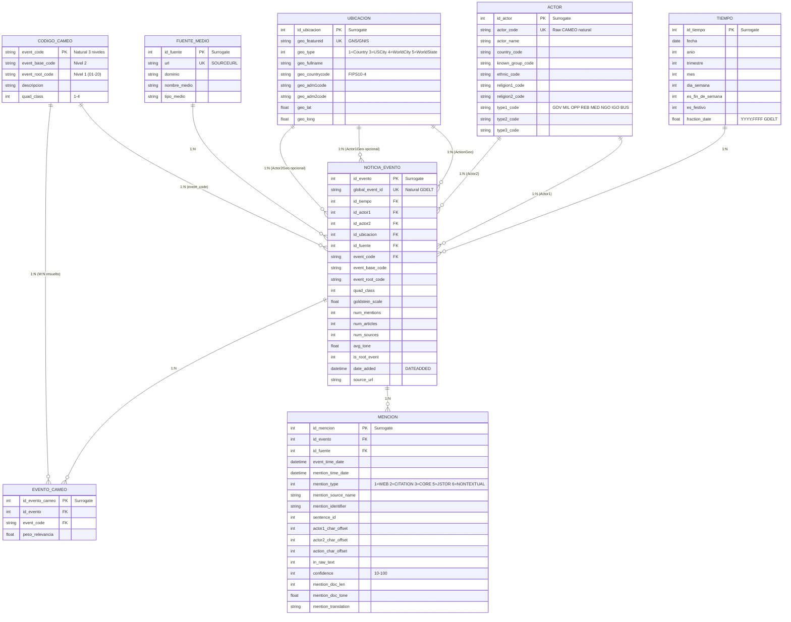
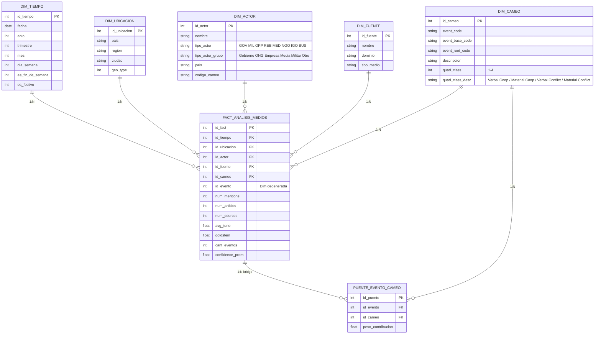
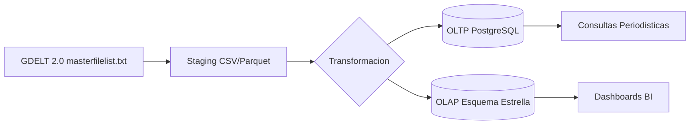
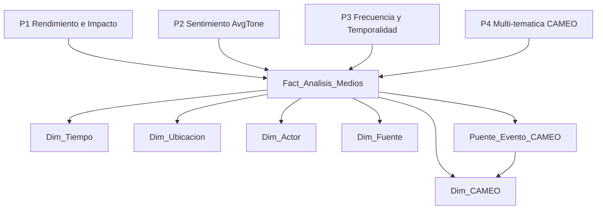

# TP2 — Bases de Datos: Diseño OLTP + OLAP (GDELT / CAMEO)

**Alumno:** Marcos Kantor  
**Comisión:** A  
**Materia:** Introducción a la Ingeniería de Datos  
**Fecha:** 25/09/2026  

**Aclaración de IA:** Utilicé Claude (Anthropic) como asistente para estructurar los modelos ER/Estrella, generar los diagramas en Mermaid y el script SQL inicial.

---

## 1) Modelo OLTP — Entidad-Relación (CAMEO/GDELT)



### Justificación de llaves

| Entidad | PK | Llave Natural (UK) | Surrogate | Motivo |
|---|---|---|---|---|
| Noticia_Evento | id_evento | GlobalEventID | Sí | ID numérico largo del origen GDELT; el surrogate acelera JOINs y desacopla |
| Actor | id_actor | ActorCode | Sí | ActorCode puede repetirse según combinación país/tipo; evita PK compuesta |
| Ubicación | id_ubicacion | Geo_FeatureID | Sí | FeatureID puede faltar en algunos registros |
| Fuente_Medio | id_fuente | URL | Sí | URLs largas → índice entero más eficiente |
| Código_CAMEO | event_code | — | No | Código corto, semántico y estable; ideal PK natural |
| Evento_CAMEO | id_evento_cameo | Compuesta (id_evento, event_code) | Sí | Puente M:N simplificado |
| Mención | id_mencion | Compuesta (id_evento, mention_identifier) | Sí | Un mismo evento puede mencionarse N veces; surrogate simplifica FKs |

### Tipos de relaciones

- `Noticia_Evento` **N:1** `Tiempo` — obligatoria
- `Noticia_Evento` **N:1** `Actor` (dos FKs: Actor1 y Actor2) — Actor1 obligatoria, Actor2 opcional
- `Noticia_Evento` **N:1** `Ubicación` (tres FKs: ActionGeo, Actor1Geo, Actor2Geo) — ActionGeo obligatoria, las otras opcionales
- `Noticia_Evento` **N:1** `Fuente_Medio` — obligatoria
- `Noticia_Evento` **M:N** `Código_CAMEO` → resuelto por `Evento_CAMEO`
- `Noticia_Evento` **1:N** `Mención` — obligatoria (todo evento tiene al menos una mención)

---

## 2) Modelo OLAP — Esquema Estrella



### Métricas de la tabla de hechos

| Métrica | Descripción | Pregunta del negocio |
|---|---|---|
| NumMentions | Total de menciones del evento en todas las fuentes | P1 — Rendimiento e Impacto |
| NumArticles | Total de artículos que mencionan el evento | P1 — Rendimiento e Impacto |
| NumSources | Total de fuentes distintas que mencionan el evento | P1 — Rendimiento e Impacto |
| AvgTone | Tono promedio de la cobertura (-100 a +100) | P2 — Sentimiento |
| GoldsteinScale | Score de impacto teórico sobre estabilidad (-10 a +10) | P2 — Sentimiento |
| CantEventos | Conteo de eventos | P3 — Frecuencia y Temporalidad |
| Confidence_Prom | Promedio de confianza de extracción (10-100) | Validación de calidad |

### Dimensión Temporal

Incluye los atributos pedidos: **Año, Trimestre, Mes, Día_Semana, Es_Fin_De_Semana, Es_Festivo**. Responde directamente a P1 (agrupación mensual) y P3 (días hábiles vs fines de semana vs festivos).

### Tabla Puente (Bridge)

`PUENTE_EVENTO_CAMEO` resuelve el **M:N** entre eventos y múltiples códigos CAMEO simultáneos (P4). Permite que un mismo evento tenga N códigos de acción/temática con un `peso_contribucion` para análisis ponderado.

### Mapeo tipo de actor (P2)

| Grupo amplio | Códigos CAMEO en `ActorType1Code` |
|---|---|
| Gobierno | GOV, COP, JUD, MIL, SPY |
| ONG / IGO | IGO, NGO, NGM |
| Empresas | MNC, BUS |
| Media | MED |
| Oposición / Rebeldes | OPP, REB, SEP, INS |
| Otros | EDU, HLH, HRI, LAB, REF, ELI |

---

## 3) Flujo ETL



---

## 4) Preguntas del negocio → modelo dimensional



---

## 5) Script SQL (SQLite / PostgreSQL)

```sql
-- ================== OLTP ==================
CREATE TABLE Tiempo (
  id_tiempo        INTEGER PRIMARY KEY,
  fecha            DATE,
  anio             INT,
  trimestre        INT,
  mes              INT,
  dia_semana       INT,
  es_fin_de_semana INT,
  es_festivo       INT,
  fraction_date    REAL
);

CREATE TABLE Actor (
  id_actor         INTEGER PRIMARY KEY,
  actor_code       TEXT UNIQUE,
  actor_name       TEXT,
  country_code     TEXT,
  known_group_code TEXT,
  ethnic_code      TEXT,
  religion1_code   TEXT,
  religion2_code   TEXT,
  type1_code       TEXT,
  type2_code       TEXT,
  type3_code       TEXT
);

CREATE TABLE Ubicacion (
  id_ubicacion     INTEGER PRIMARY KEY,
  geo_featureid    TEXT UNIQUE,
  geo_type         INT,
  geo_fullname     TEXT,
  geo_countrycode  TEXT,
  geo_adm1code     TEXT,
  geo_adm2code     TEXT,
  geo_lat          REAL,
  geo_long         REAL
);

CREATE TABLE Fuente_Medio (
  id_fuente    INTEGER PRIMARY KEY,
  url          TEXT UNIQUE,
  dominio      TEXT,
  nombre_medio TEXT,
  tipo_medio   TEXT
);

CREATE TABLE Codigo_CAMEO (
  event_code      TEXT PRIMARY KEY,
  event_base_code TEXT,
  event_root_code TEXT,
  descripcion     TEXT,
  quad_class      INT
);

CREATE TABLE Noticia_Evento (
  id_evento       INTEGER PRIMARY KEY,
  global_event_id TEXT UNIQUE,
  id_tiempo       INT REFERENCES Tiempo(id_tiempo),
  id_actor1       INT REFERENCES Actor(id_actor),
  id_actor2       INT REFERENCES Actor(id_actor),
  id_ubicacion    INT REFERENCES Ubicacion(id_ubicacion),
  id_fuente       INT REFERENCES Fuente_Medio(id_fuente),
  event_code      TEXT REFERENCES Codigo_CAMEO(event_code),
  event_base_code TEXT,
  event_root_code TEXT,
  quad_class      INT,
  goldstein_scale REAL,
  num_mentions    INT,
  num_articles    INT,
  num_sources     INT,
  avg_tone        REAL,
  is_root_event   INT,
  date_added      TIMESTAMP,
  source_url      TEXT
);

CREATE TABLE Evento_CAMEO (
  id_evento_cameo INTEGER PRIMARY KEY,
  id_evento       INT REFERENCES Noticia_Evento(id_evento),
  event_code      TEXT REFERENCES Codigo_CAMEO(event_code),
  peso_relevancia REAL
);

CREATE TABLE Mencion (
  id_mencion          INTEGER PRIMARY KEY,
  id_evento           INT REFERENCES Noticia_Evento(id_evento),
  id_fuente           INT REFERENCES Fuente_Medio(id_fuente),
  event_time_date     TIMESTAMP,
  mention_time_date   TIMESTAMP,
  mention_type        INT,
  mention_source_name TEXT,
  mention_identifier  TEXT,
  sentence_id         INT,
  actor1_char_offset  INT,
  actor2_char_offset  INT,
  action_char_offset  INT,
  in_raw_text         INT,
  confidence          INT,
  mention_doc_len     INT,
  mention_doc_tone    REAL,
  mention_translation TEXT
);

-- ================== OLAP ==================
CREATE TABLE Dim_Tiempo (
  id_tiempo        INTEGER PRIMARY KEY,
  fecha            DATE,
  anio             INT,
  trimestre        INT,
  mes              INT,
  dia_semana       INT,
  es_fin_de_semana INT,
  es_festivo       INT
);

CREATE TABLE Dim_Ubicacion (
  id_ubicacion INTEGER PRIMARY KEY,
  pais         TEXT,
  region       TEXT,
  ciudad       TEXT,
  geo_type     INT
);

CREATE TABLE Dim_Actor (
  id_actor         INTEGER PRIMARY KEY,
  nombre           TEXT,
  tipo_actor       TEXT,
  tipo_actor_grupo TEXT,
  pais             TEXT,
  codigo_cameo     TEXT
);

CREATE TABLE Dim_Fuente (
  id_fuente  INTEGER PRIMARY KEY,
  nombre     TEXT,
  dominio    TEXT,
  tipo_medio TEXT
);

CREATE TABLE Dim_CAMEO (
  id_cameo        INTEGER PRIMARY KEY,
  event_code      TEXT,
  event_base_code TEXT,
  event_root_code TEXT,
  descripcion     TEXT,
  quad_class      INT,
  quad_class_desc TEXT
);

CREATE TABLE Fact_Analisis_Medios (
  id_fact         INTEGER PRIMARY KEY,
  id_tiempo       INT REFERENCES Dim_Tiempo(id_tiempo),
  id_ubicacion    INT REFERENCES Dim_Ubicacion(id_ubicacion),
  id_actor        INT REFERENCES Dim_Actor(id_actor),
  id_fuente       INT REFERENCES Dim_Fuente(id_fuente),
  id_cameo        INT REFERENCES Dim_CAMEO(id_cameo),
  id_evento       INT,
  num_mentions    INT,
  num_articles    INT,
  num_sources     INT,
  avg_tone        REAL,
  goldstein       REAL,
  cant_eventos    INT,
  confidence_prom REAL
);

CREATE TABLE Puente_Evento_CAMEO (
  id_puente         INTEGER PRIMARY KEY,
  id_evento         INT,
  id_cameo          INT REFERENCES Dim_CAMEO(id_cameo),
  peso_contribucion REAL
);

-- Indices
CREATE INDEX idx_fact_tiempo ON Fact_Analisis_Medios(id_tiempo);
CREATE INDEX idx_fact_ubic   ON Fact_Analisis_Medios(id_ubicacion);
CREATE INDEX idx_fact_actor  ON Fact_Analisis_Medios(id_actor);
CREATE INDEX idx_fact_cameo  ON Fact_Analisis_Medios(id_cameo);
CREATE INDEX idx_puente_ev   ON Puente_Evento_CAMEO(id_evento);
CREATE INDEX idx_puente_cam  ON Puente_Evento_CAMEO(id_cameo);
CREATE INDEX idx_mencion_ev  ON Mencion(id_evento);
CREATE INDEX idx_mencion_fte ON Mencion(id_fuente);
```

### Consulta de ejemplo (P1)

```sql
SELECT du.pais, dt.anio, dt.mes,
       SUM(f.num_mentions) AS total_menciones,
       SUM(f.num_articles) AS total_articulos
FROM Fact_Analisis_Medios f
JOIN Dim_Ubicacion du ON du.id_ubicacion = f.id_ubicacion
JOIN Dim_Tiempo    dt ON dt.id_tiempo    = f.id_tiempo
GROUP BY du.pais, dt.anio, dt.mes
ORDER BY total_menciones DESC;
```
